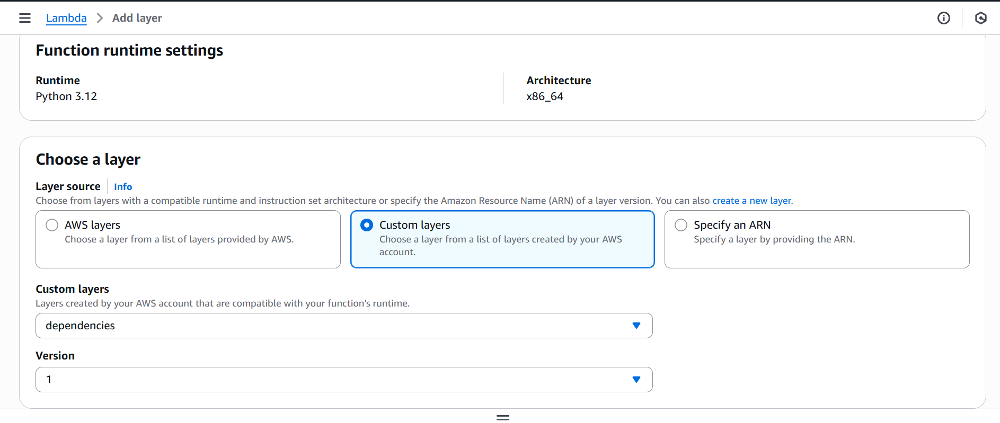
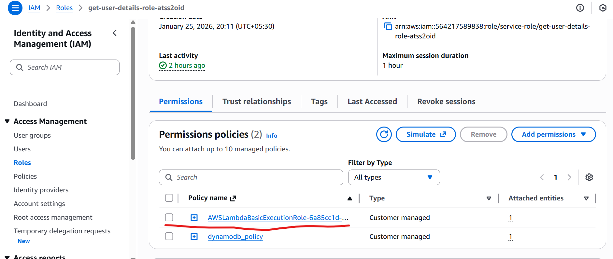
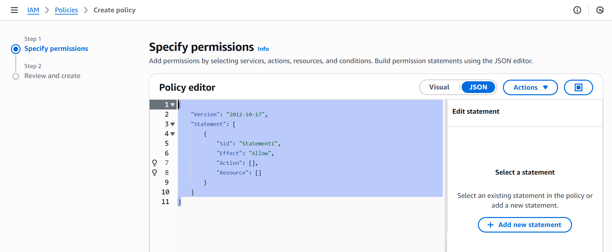
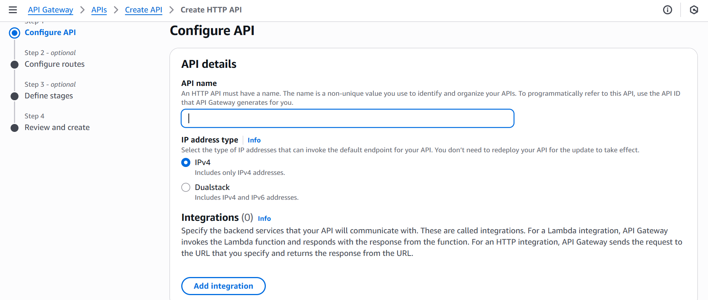
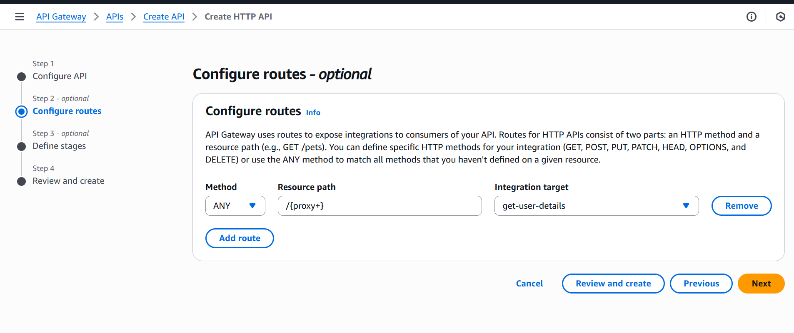
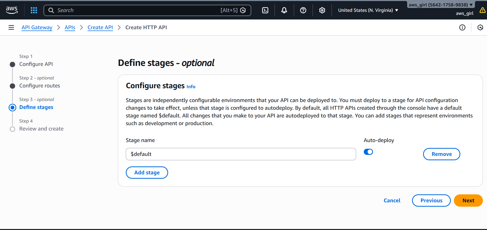
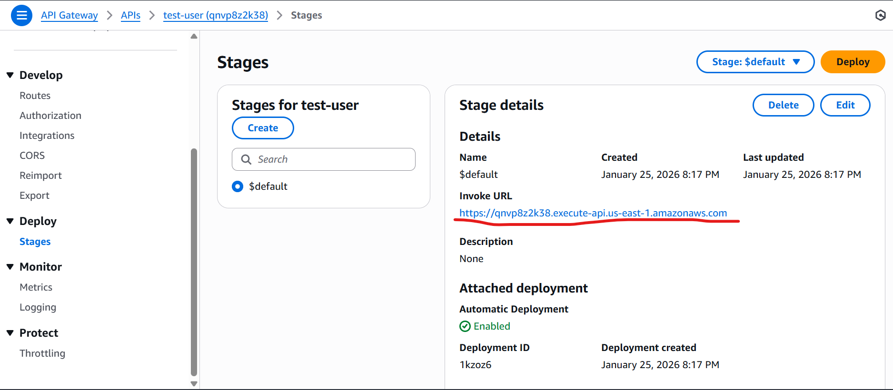

### An example project illustrating how to build and deploy Python FastAPI-based APIs with Amazon DynamoDB using a serverless AWS Lambda and API Gateway architecture.
To run **Python FastAPI–based REST APIs on AWS Lambda**, the **Mangum** adapter must be used.
Below steps need to be followed

Step 1: Run an interactive Amazon Linux container (Windows → Lambda layer)

`docker run -it --rm -v ${PWD}:/var/task public.ecr.aws/sam/build-python3.12`

Step 2: Build the Lambda layer inside the container

`mkdir -p python
pip install -r requirements.txt -t python
exit`

This installs all dependencies into the python/ directory, which is required for Lambda layers.

Step 3: Zip the layer on Windows

`Compress-Archive -Path python -DestinationPath lambda-layer.zip`

The resulting ZIP file must have python/ at the root level:

lambda-layer.zip
└── python/
    └── site-packages...

This ZIP is now ready to be uploaded as an AWS Lambda layer.

Create lambda layer in AWS management console

There are three ways to create lambda function
1. Author from Scratch

Creates a Lambda function by writing custom code using a supported runtime, giving full 
control over logic and dependencies.

2. Blueprint 

Creates a Lambda function from a prebuilt template that includes sample code and common triggers
to speed up development.

3. Container Image

Creates a Lambda function using a Docker container image, allowing custom runtimes and complex 
dependencies packaged up to 10 GB.

For this exercise, select Author from scratch and upload the project in .zip format.
To create the ZIP file, navigate to the project’s source directory and run the following PowerShell command (applicable on Windows)

``Compress-Archive `
  -Path app, main.py `
  -DestinationPath function.zip``

Linux/Mac

`zip -r function.zip app main.py \
  -x "__pycache__/*" "*.pyc"`

Upload ZIP to Lambda

Attach Lambda Layer (Dependencies)

Make sure the Layer:

Contains fastapi, mangum, pydantic, etc.

Built with the same Python runtime (e.g. Python 3.11)

Layer structure is:

python/
 ├── fastapi/
 ├── mangum/
 ├── pydantic/

Runtime setting change Handler

app.main.handler

When the Lambda function is created, it will be automatically attached to a **basic execution role**.

This coding exercise uses **DynamoDB** to perform CRUD operations, so a **custom IAM policy with least-privilege permissions** must be created and attached to the Lambda execution role.

`{
    "Version": "2012-10-17",
    "Statement": [
        {
            "Sid": "VisualEditor0",
            "Effect": "Allow",
            "Action": [
                "dynamodb:CreateTable",
                "dynamodb:PutItem",
                "dynamodb:DescribeTable",
                "dynamodb:DeleteItem",
                "dynamodb:GetItem",
                "dynamodb:Query",
                "dynamodb:UpdateItem",
                "dynamodb:DeleteTable",
                "dynamodb:UpdateTable"
            ],
            "Resource": "arn:aws:dynamodb:*:564217589838:table/*"
        },
        {
            "Sid": "VisualEditor1",
            "Effect": "Allow",
            "Action": "dynamodb:Query",
            "Resource": "arn:aws:dynamodb:*:564217589838:table/*/index/*"
        }
    ]
}`

This is required because AWS Lambda does not have permission to access DynamoDB by default.

The basic Lambda execution role only allows logging to CloudWatch.

Performing CRUD operations on DynamoDB requires explicit permissions such as PutItem, GetItem, UpdateItem, and DeleteItem.

AWS follows the principle of least privilege, which means the Lambda function should be granted only the permissions it actually needs, and nothing more.

Creating a custom IAM policy ensures the Lambda function can access only the specific DynamoDB table and actions required, reducing security risk.

Without this policy, any attempt by the Lambda function to access DynamoDB will fail with an AccessDeniedException.

Once completed, create a **DynamoDB table** named **`purchase_order`** with **`order_number`** as the **partition key**.

API gateway

Choose an API type > HTTP API> click on Build
Enter the unique API name

Add an **Integration** by selecting the **Lambda function** created in the previous steps. Make sure the **region matches** the region of the Lambda function.

Configure routes

Define stages such as **Dev, QA, and Prod**. For this exercise, I used **$default**.

After creation, obtain the **Invoke URL**.

Note that no authentication mechanism is used for this exercise; however, AWS typically uses **JWT** and **Lambda authorizers** for authentication.

Test the APIs using the payload below with a client tool such as **Postman**.

{
  "order_number": "PO10026",
  "customer_id": "123",
  "items": [
    {
      "item_number": "101",
      "qty": 10,
      "price": "12"
    }
  ],
  "total": "120",
  "payment_id": "6f1d7e9e-4d4a-4b1a-b9a9-1f2e8cce0a1f"
}

Verify the record in DynamoDB table

